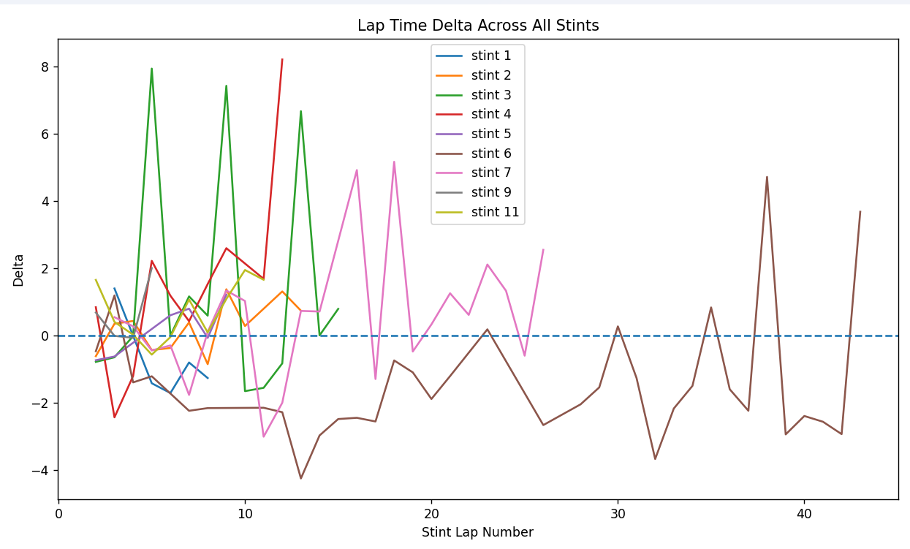
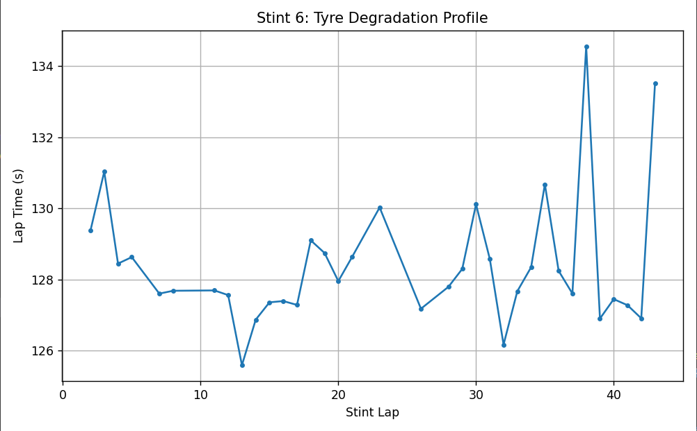

#  Fuel Burn Framework

A modular Python framework for extracting, cleaning and analysing FIA World Endurance Championship (WEC) race timing data to study tyre degradation and long-run performance.

The project converts official FIA timing PDFs into structured lap by lap datasets, automatically detects pit stops and stints, calculates lap time degradation relative to an early stint baseline, and produces visualisations that help analyse race pace consistency.

---

##  Example Results

### Combined Tyre Degradation Comparison



Comparison of lap time delta across every detected stint. Each stint is normalised against its own early stint baseline (laps 3–6), allowing tyre degradation trends to be compared independently of absolute lap time.

---

### Representative Long Stint



Example of a 43 lap stint showing lap time progression throughout the run. This visualisation highlights both pace consistency and increasing variability later in the stint.

---

### Summary Statistics

| Stint | Length | Fastest Lap | Variance Ratio |
|------:|-------:|------------:|---------------:|
| 3 | 15 | 10 | 0.88 |
| 6 | 43 | 13 | 1.98 |
| 7 | 26 | 11 | 1.17 |

The framework automatically computes:

- Stint length
- Fastest lap location
- Variance ratio
- Delta lap time

These metrics provide quantitative indicators of tyre performance across a race.

---

#  Features

- Extracts lap timing data directly from FIA WEC PDF timing sheets
- Converts semi structured timing reports into clean tabular datasets
- Automatically detects pit stops and race stints
- Computes lap time delta relative to an early stint baseline
- Removes abnormal laps caused by pit stops and race interruptions
- Calculates stint statistics including variance ratio and fastest lap
- Produces individual and combined tyre degradation visualisations
- Modular pipeline for future machine learning integration

---

#  Methodology

The framework follows a modular data processing pipeline.

## 1. Data Extraction

Official FIA WEC timing PDFs are parsed using Camelot.

The extracted tables are merged into a single dataframe before lap timing columns are isolated.

---

## 2. Data Cleaning

The extracted data is cleaned by:

- Removing invalid rows
- Filtering non car entries
- Reconstructing lap order
- Converting lap times into seconds

---

## 3. Stint Detection

Pit stops are identified using an adaptive threshold based on the median lap time.

```
Lap Time > Median Lap Time × 1.8
```

Each detected pit stop marks the beginning of a new stint.

---

## 4. Baseline Calculation

Instead of using the fastest lap, the framework computes a stable baseline from laps **3–6** of every stint.

```
Delta = Lap Time − Baseline Lap Time
```

This reduces the influence of:

- Out laps
- Cold tyres
- Initial tyre warm up

---

## 5. Lap Cleaning

Non-representative laps are removed before analysis.

Current filters remove laps outside the acceptable delta window to minimise the influence of:

- Pit entry
- Pit exit
- Safety Car
- Full Course Yellow
- Heavy traffic

---

## 6. Tyre Degradation Analysis

For each qualifying stint the framework computes:

- Stint length
- Fastest lap
- Early stint variability
- Late stint variability
- Variance ratio

```
Variance Ratio =
Late Stint Standard Deviation
─────────────────────────────
Early Stint Standard Deviation
```

A higher variance ratio indicates increasing lap time inconsistency later in the stint.

---

#  Project Structure

```
Fuel-Burn-Framework/
│
├── data/
│   ├── raw/
│   │   └── 19_AnalysisByLap_Race_Hour_6.PDF
│   │
│   └── processed/
│       └── laps.csv
│
├── images/
│   ├── combined_delta.png
│   ├── stint6_profile.png
│   └── summary_statistics.png
│
├── src/
│   ├── extract.py
│   ├── analysis.py
│   └── utils.py
│
├── requirements.txt
└── README.md
```

---

#  Installation

Clone the repository.

```bash
git clone https://github.com/yourusername/Fuel-Burn-Framework.git
```

Move into the project.

```bash
cd Fuel-Burn-Framework
```

Install the dependencies.

```bash
pip install -r requirements.txt
```

---

#  Usage

### Extract lap timing data

```bash
python src/extract.py
```

Outputs:

```
data/processed/laps.csv
```

---

### Run the tyre degradation analysis

```bash
python src/analysis.py
```

The script automatically:

- Detects pit stops
- Segments race stints
- Computes lap time delta
- Generates degradation plots
- Produces stint statistics

---

#  Future Improvements

Planned extensions include:

- Fuel burn estimation
- Random Forest regression for fuel consumption prediction
- Driver comparison across multiple races
- Multi race dataset support
- Interactive dashboards using Tableau
- Strategy recommendation metrics

---

#  Built With

- Python
- Pandas
- Camelot
- Matplotlib
- NumPy
- Scikit-learn

---

#  License

This project is released under the MIT License.

---

#  Author

**Neil Gehlot**

Data Science Undergraduate | Motorsport Analytics | Machine Learning
